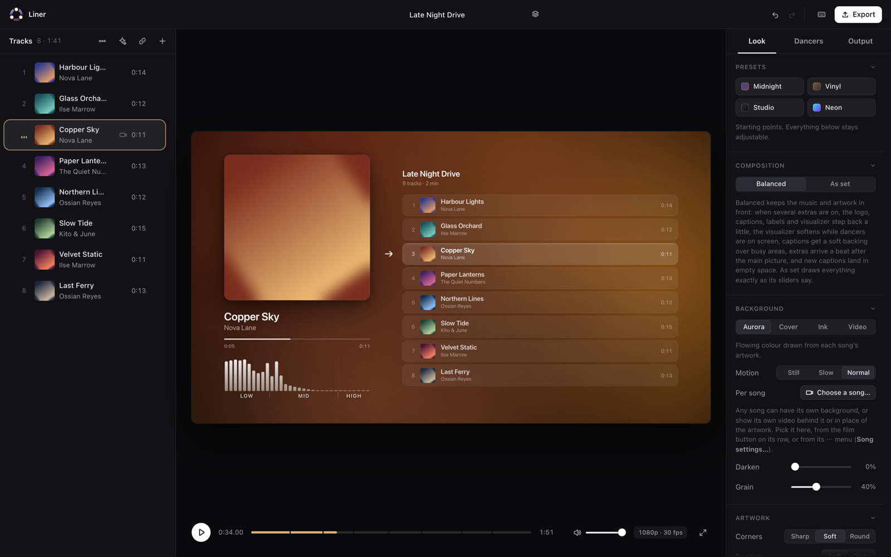
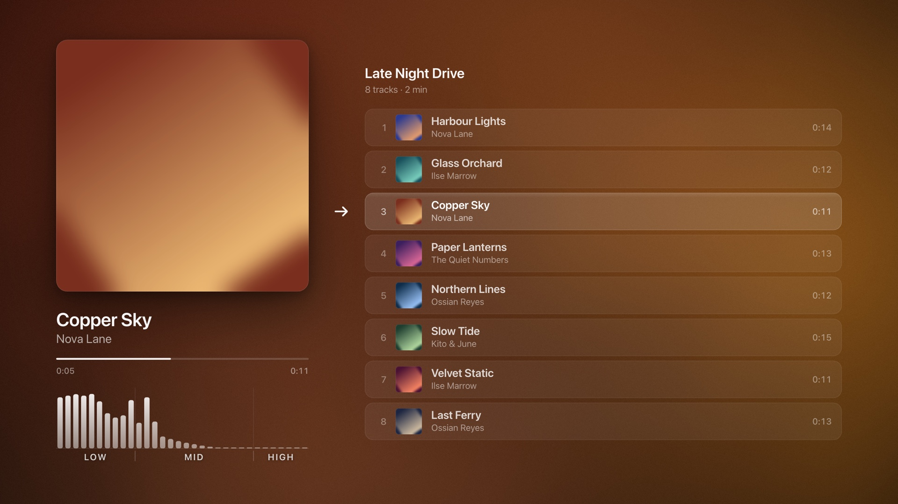
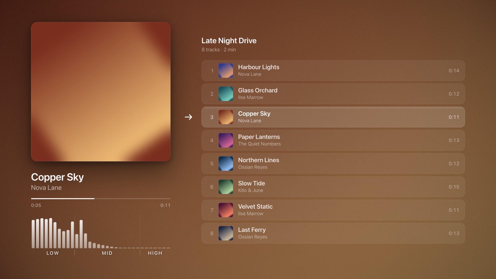
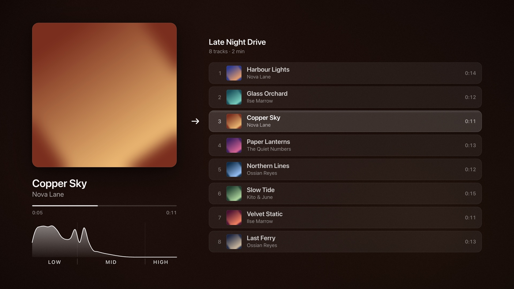

# Liner

Turn a list of songs into a mix video. The current song's artwork sits on the left, the tracklist on the right with a marker that glides from song to song, and behind it all a background Liner generates from each cover's colours. Add a frequency visualizer, captions, a logo, a looping video, or dancing sprites that step to the beat. Render at any size and frame rate, hardware-encoded, with a sample-exact soundtrack.

Everything runs on your own computer: a zero-dependency Node server plus a page that does the drawing on the GPU. Nothing is uploaded anywhere.



## What it does

- **Drop songs in, get a video out.** MP3, FLAC, WAV, AIFF, M4A, OGG and more, or the sound of a video file. Titles, artists and embedded covers are read from the tags; a missing cover becomes a generated tile.
- **Fetch from a link.** Paste YouTube or SoundCloud links (songs, playlists, sets); `yt-dlp` downloads the best audio with its artwork and you pick what goes in.
- **Find cover art automatically.** One click searches Apple Music, Deezer and the Cover Art Archive, ranks the candidates and shows real pixel sizes. No accounts, no keys.
- **Trim, crossfade, reorder.** Sample-exact trims with a waveform, optional fades, trim-to-silence and snap-to-beats; equal-power crossfades; drag to reorder or sort by title, artist, length, tempo or energy.
- **Four backgrounds.** *Aurora* (flowing colour from the artwork), *Cover* (the art, softened), *Ink* (dark and quiet), or your own **video** on a loop. Any song can override the mix's background or show its own video.
- **A frequency visualizer** (bars, three bands, or a wave) computed on the server from the decoded audio, so the preview and the export show exactly the same picture.
- **Dancers.** Drop a GIF, an animated PNG/WebP, a short video or a set of stills; Liner knocks out the background, keeps pixel art crisp and makes the sprite step in time with the detected beats. An *Auto* mode puts dancers only on the lively tracks.
- **Captions and a logo**, placed anywhere with snapping guides; a "Now playing" label, an "Up next" line, a mix clock, a waveform progress bar.
- **Any output.** 720p to 8K, 24/25/30/60 fps, H.264 or HEVC, AAC 320 kb/s or Apple Lossless, with a bass booster that will not clip. 1080p30 renders at roughly 300 frames per second on an Apple-silicon Mac.
- **The preview is the export**, frame for frame. Mixes save themselves as you work, with full undo and redo.

| Aurora background with bars | Cover background | Ink background with a wave |
| --- | --- | --- |
|  |  |  |

## Quick start

You need [Node.js](https://nodejs.org) 18 or newer and [FFmpeg](https://ffmpeg.org) (`ffmpeg` and `ffprobe` on your PATH). `yt-dlp` is optional, for the link feature.

```bash
git clone https://github.com/GodisGood-GodisGreat-and-GodisReal-Amen/Liner.git
cd Liner
npm start
```

Then open <http://localhost:8865> in Chrome, Edge or another Chromium browser. Drop a few songs in, press play, press **Export**. The video lands in the `Exports/` folder next to the code.

There is nothing to install with npm: Liner has no dependencies. The [startup guide](docs/getting-started.md) walks through installing FFmpeg on each system, the first mix, and where everything goes.

## Documentation

- [Getting started](docs/getting-started.md): requirements, installation, your first mix, updating, environment variables.
- [User manual](docs/manual.md): every control, sheet and shortcut, tab by tab.
- [How it works](docs/architecture.md): the pipeline, the modules, the cache layout and the HTTP API.
- [Troubleshooting](docs/troubleshooting.md): what to do when something does not look right.
- [Contributing](CONTRIBUTING.md) and the [changelog](CHANGELOG.md).

## How it works, in one paragraph

The server (`server.mjs`) ingests each song once: `ffprobe` reads the tags and the attached picture, then one `ffmpeg` pass decodes it to 48 kHz 24-bit PCM (for a sample-exact join later) and a small AAC preview for the browser. The page renders every frame itself (`public/renderer.js`): a WebGL shader draws the background, Canvas 2D draws the artwork, type, list, visualizer and dancers. Every frame is a pure function of the time, so the preview and the export are identical. On export the page encodes through WebCodecs (two hardware encoders working on two halves of the video at once) and streams the bitstream to the server, which stamps constant-frame-rate timestamps, joins the songs' PCM with the chosen gaps or crossfades, encodes the audio and writes an MP4 with BT.709 tags. Without WebCodecs, raw frames go to `ffmpeg` instead (slower, same result).

## Platforms and browsers

Liner was built and tuned on macOS with Apple silicon, where it uses the VideoToolbox encoders and Apple's AAC and ALAC codecs. It also runs on Linux and Windows with FFmpeg's `libx264`, `libx265`, `aac` and `alac`; the preview and export work the same way. Two conveniences are macOS-only for now: the system folder chooser for *Save mix… › Somewhere else* and *Load mix… › Somewhere else* (the `Mixes/` folder works everywhere), and the *Reveal* button uses Finder, Explorer or your desktop's file manager as appropriate.

The page needs a Chromium browser (Chrome, Edge, Brave, Arc…) for GPU encoding and for video backgrounds. Safari 16.4 and Firefox can run the editor and export through the ffmpeg fallback, but video backgrounds need WebCodecs.

## Privacy and network use

Liner listens on `127.0.0.1` only and refuses requests from other origins. It talks to the internet in exactly three cases, all started by you: the cover art finder queries the iTunes Search API, Deezer and MusicBrainz/Cover Art Archive; *Add from a link* runs `yt-dlp`; a song's *own video* for a linked song is fetched with `yt-dlp`. Nothing is sent anywhere otherwise, there is no telemetry, and all working data stays in the project folder (`.cache/`, `Exports/`, `Downloads/`, `Mixes/`), which Git ignores.

## License

Apache License 2.0. See [LICENSE](LICENSE).
